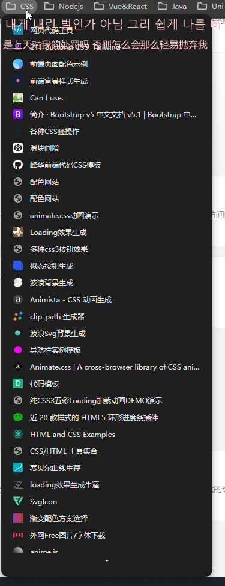

# README

`@umijs/max` 模板项目，更多功能参考 [Umi Max 简介](https://umijs.org/docs/max/introduce)

# 优化建议

## 1.收起显示图标 ok

## 2.配色好看点

## 3.补全图标

## 4.增加 ui 库和网站

## 5.动画网页 加载太慢

## 6.首屏加载慢

## 7.跳转外站增加免责声明 ok

## 8.用户增加自定义框架

## 9.框架库导出本地

## 10.站点名称和图标丑

## 11.增加筛选

## 12.最近使用

## 13.书签导入

## 14.

## 15.增加明暗主题切换
