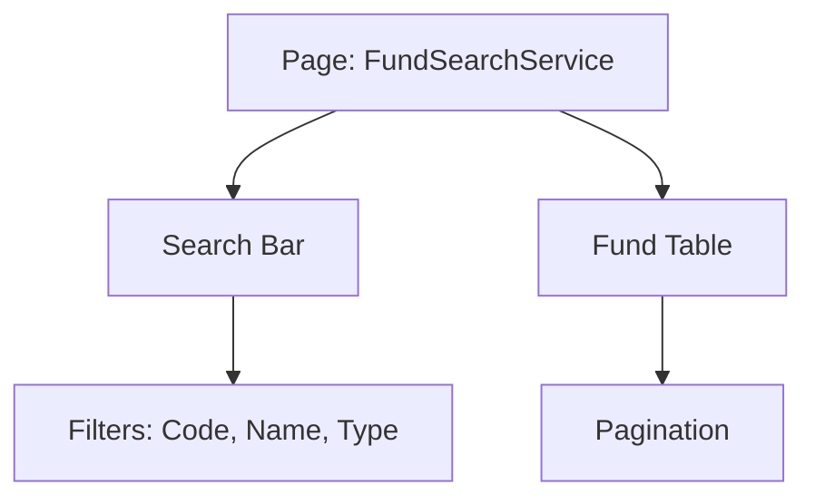

# DESIGN_fund-search-service

## 整体架构

- **页面组件**: `FundSearchService`
- **样式方案**: LESS Modules
- **UI 库**: `antd`, `@ant-design/pro-components`

## 模块设计

- **搜索区域**: 使用 `ProTable` 内置的搜索表单。
- **列表区域**: `ProTable` 表格，展示基金的基本信息（代码、名称、净值、涨跌幅等）。
- **数据流**: 目前采用 mock 数据，通过 `ProTable` 的 `request` 属性异步加载。

## 接口规范 (Mock)

- `GET /api/funds`: 返回基金列表数据。
- 字段: `code`, `name`, `type`, `netValue`, `changeRate`, `manager`。

## 页面布局

## 异常处理

- 表格加载失败显示错误提示。
- 数据为空时显示空状态。
