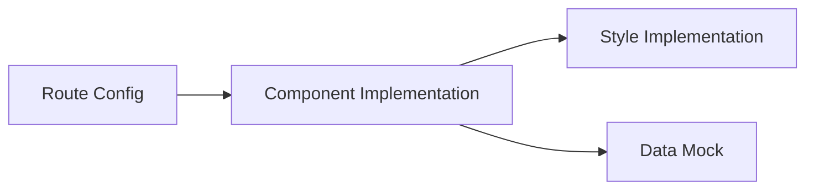

# TASK_fund-search-service

## 原子任务拆分

### 1. 路由配置 (Route Config)

- **输入**: `config/routes.ts`
- **操作**: 在 `前端草稿` 下新增 `基金检索服务` 路由。
- **输出**: 路由文件更新。
- **依赖**: 无。

### 2. 组件实现 (Component Implementation)

- **路径**: `src/pages/FrontendCard/FundSearchService/index.tsx`
- **输入**: `DESIGN_fund-search-service.md`
- **操作**: 使用 `React.FC` 和 `ProTable` 实现页面布局。
- **输出**: 新增 tsx 文件。
- **依赖**: 任务 1。

### 3. 样式实现 (Style Implementation)

- **路径**: `src/pages/FrontendCard/FundSearchService/index.less`
- **操作**: 编写基础样式，确保布局美观。
- **输出**: 新增 less 文件。
- **依赖**: 任务 2。

### 4. 数据 Mock (Optional)

- **操作**: 在组件内或 `mock/` 中添加简单的模拟数据。
- **输出**: 页面可展示数据。
- **依赖**: 任务 2。

## 任务依赖图

