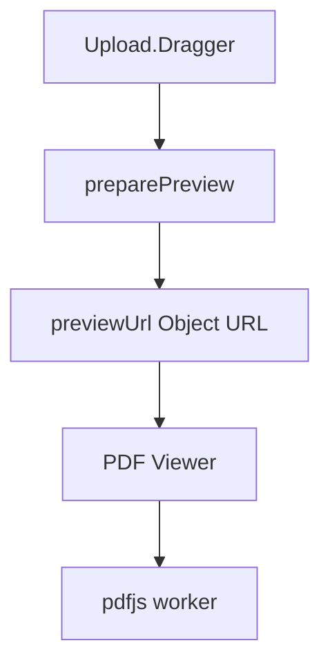

## 架构图

## 分层设计与核心组件

- 页面层：Upload/Pdf 页面复用 DocumentUploadPreview
- 组件层：DocumentUploadPreview 负责文件校验、预览与上传状态
- 预览层：@react-pdf-viewer/core + default-layout 插件

## 模块依赖

- DocumentUploadPreview -> @react-pdf-viewer/core
- @react-pdf-viewer/core -> pdfjs-dist worker

## 接口契约

- 输入：Upload.Dragger 选择的 File
- 输出：预览区域渲染 PDF

## 数据流向

- File -> Object URL -> Viewer -> 预览渲染

## 异常处理策略

- 文件校验失败：给出 message.error 并阻止上传
- 预览失败：复用现有 previewError 文案
