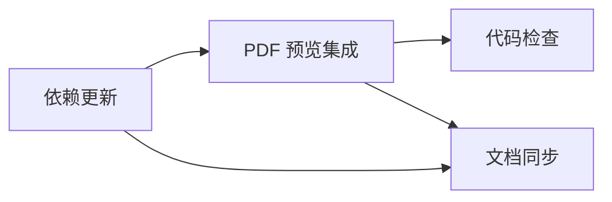

## 任务拆分

### 任务 1：依赖更新

- 输入契约：package.json
- 输出契约：新增 PDF 预览依赖
- 实现约束：使用 pnpm 依赖格式
- 依赖关系：无

### 任务 2：PDF 预览集成

- 输入契约：DocumentUploadPreview 组件
- 输出契约：PDF 预览替换为第三方库
- 实现约束：保持 Word/PPT 逻辑不变
- 依赖关系：任务 1

### 任务 3：文档同步

- 输入契约：6A 文档目录
- 输出契约：ALIGNMENT/CONSENSUS/DESIGN/TASK/ACCEPTANCE/FINAL/TODO
- 实现约束：与实现保持一致
- 依赖关系：任务 1、任务 2

### 任务 4：代码检查

- 输入契约：项目既有命令
- 输出契约：无新增 lint 错误
- 实现约束：使用 ESLint 与 Stylelint
- 依赖关系：任务 2

## 依赖关系图

