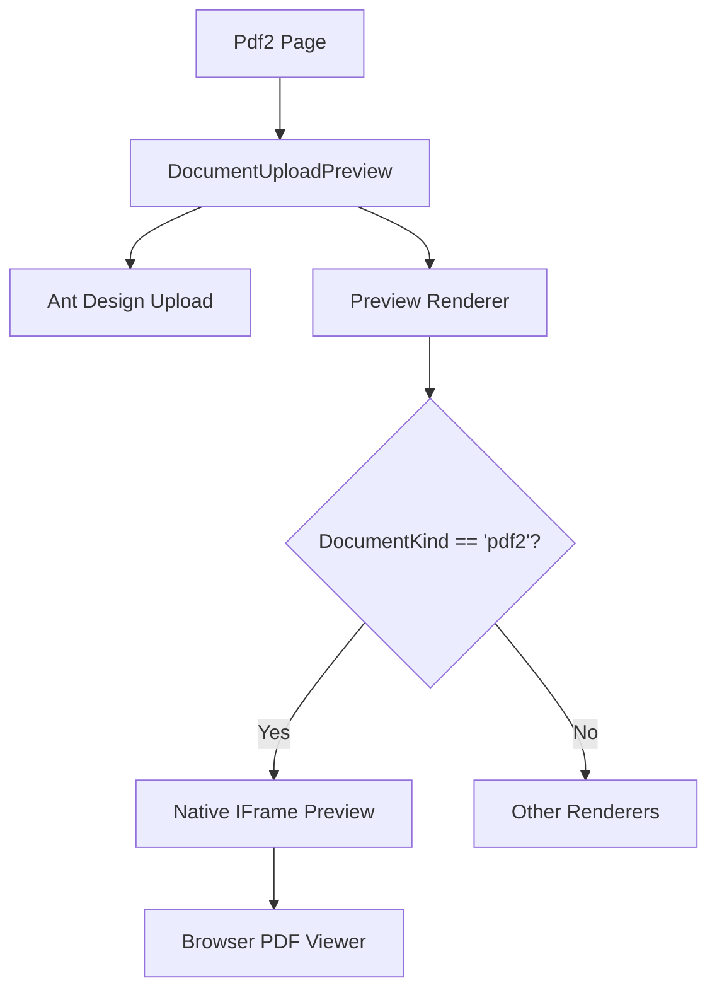

# DESIGN - PDF2 预览系统设计

## 1. 整体架构图



## 2. 核心组件设计

- **Pdf2 Page**: 入口页面，配置 `DocumentUploadPreview` 的参数（title, kind="pdf2" 等）。
- **DocumentUploadPreview**:
  - **状态管理**: 维护 `previewUrl` (Blob URL)。
  - **条件渲染**: 增加对 `pdf2` 的判断。
  - **原生渲染代码**:
    ```tsx
    <iframe
      src={previewUrl}
      width="100%"
      height="620px"
      style={{ border: 'none' }}
      title="PDF Native Preview"
    />
    ```

## 3. 数据流向

1. 用户选择 PDF 文件。
2. `Upload` 组件触发 `customRequest`。
3. `preparePreview` 生成 `Blob URL` 并设置给 `previewUrl`。
4. `DocumentUploadPreview` 检测到 `kind === 'pdf2'`。
5. 渲染 `<iframe>`，浏览器加载 `Blob URL` 并调用内置 PDF 插件。

## 4. 异常处理策略

- **不支持 PDF 的浏览器**: 虽然极少，但可以通过 `extra` 区域的下载按钮作为兜底。
- **文件解析失败**: `preparePreview` 捕获异常并显示错误信息。
