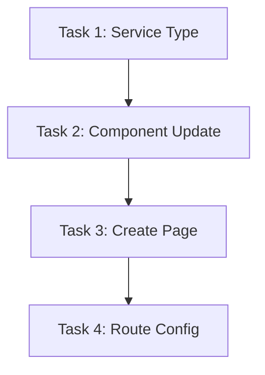

# TASK - PDF2 预览原子任务拆分

## 1. 子任务清单

### Task 1: 扩展服务类型

- **输入**: `src/services/uploadDocument.ts`
- **输出**: 更新后的 `DocumentKind` 类型。
- **验收标准**: 类型包含 `pdf2`，编译不报错。

### Task 2: 增强通用上传预览组件

- **输入**: `src/pages/Upload/components/DocumentUploadPreview.tsx`
- **输出**: 支持 `pdf2` 渲染逻辑的组件。
- **实现细节**:
  - 更新描述文字。
  - 在渲染区域增加 `kind === 'pdf2'` 的判断。
  - 使用 `<iframe>` 嵌入 `previewUrl`。
- **验收标准**: 当 `kind` 为 `pdf2` 时，正确渲染 `<iframe>`。

### Task 3: 创建 Pdf2 页面

- **输入**: `src/pages/Upload/Pdf2/index.tsx` (新文件)
- **输出**: 调用 `DocumentUploadPreview` 的 React 组件。
- **验收标准**: 文件存在且正确导出。

### Task 4: 配置路由

- **输入**: `config/routes.ts`
- **输出**: 新增 `/upload/pdf2` 路由配置。
- **验收标准**: 侧边栏出现 `PDF 预览 2` 菜单。

## 2. 依赖关系图

