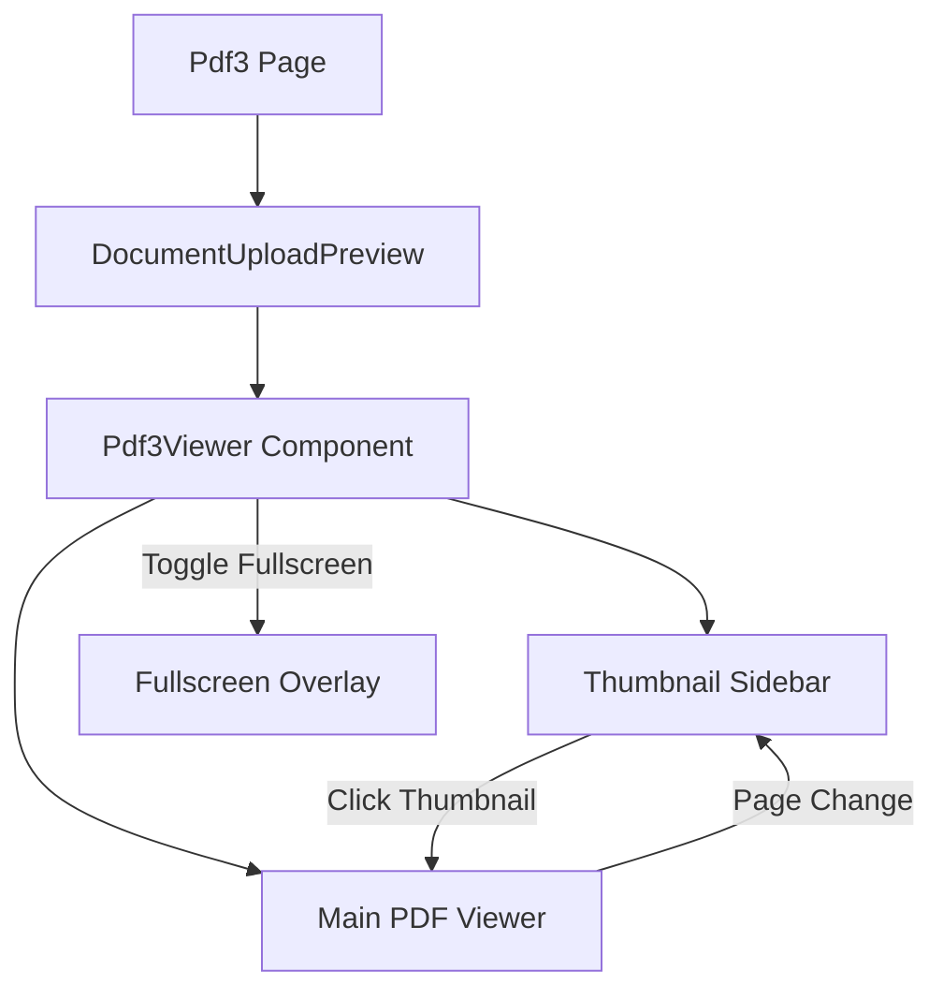

# DESIGN - PDF3 预览系统设计

## 1. 整体架构图

## 2. 核心组件设计: Pdf3Viewer

- **数据输入**: 接收 `file: File` 或 `fileBuffer: ArrayBuffer`。
- **插件集成**:
  - `thumbnailPlugin`: 提供左侧缩略图渲染能力。
  - `pageNavigationPlugin`: (可选) 用于主视图与缩略图的同步联动。
- **布局设计**:
  - 使用 Flex 布局。
  - 左侧 `Sidebar`: 固定宽度 200px，背景浅灰，自定义渲染缩略图项以支持高亮。
  - 右侧 `MainView`: 占据剩余空间，渲染 PDF 内容。
- **状态管理**:
  - `currentPage`: 记录当前所在页码，用于高亮缩略图。
  - `isFullscreen`: 切换全屏显示状态。

## 3. 交互逻辑

1. **缩略图点击**: 调用插件提供的跳转方法，定位主视图到对应页。
2. **高亮同步**: 监听主视图滚动事件，当页面可见性变化时，更新 `currentPage` 并使左侧缩略图自动滚动到可视区。
3. **全屏切换**: 开启全屏时，组件覆盖整个浏览器视口。

## 4. 异常处理

- 文件加载失败显示项目标准的 `previewError` 提示。
- 缩略图生成失败时的占位处理。
