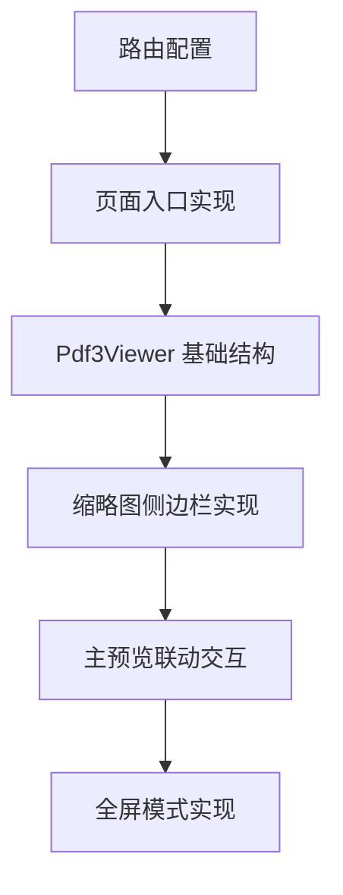

# TASK - PDF3 预览原子任务拆解

## 1. 任务依赖图

## 2. 原子任务定义

### Task 1: 路由配置与入口页面

- **内容**:
  - 修改 `config/routes.ts` 增加 `/upload/pdf3` 路由。
  - 创建 `src/pages/Upload/Pdf3/index.tsx`。
- **验收标准**: 侧边栏菜单出现“PDF 预览 3”，点击可进入空白上传页。

### Task 2: Pdf3Viewer 基础框架

- **内容**:
  - 创建 `src/pages/Upload/components/Pdf3Viewer.tsx`。
  - 集成 `Worker` 与 `Viewer`，实现基础 PDF 展示。
- **验收标准**: 上传文件后能正常看到 PDF 内容。

### Task 3: 缩略图侧边栏实现

- **内容**:
  - 使用 `@react-pdf-viewer/thumbnail` 插件。
  - 实现左侧固定宽度 200px 布局。
  - 自定义缩略图样式，使其符合 Ant Design 风格。
- **验收标准**: 左侧出现缩略图列表。

### Task 4: 联动交互与高亮

- **内容**:
  - 实现点击缩略图跳转页面。
  - 监听 `onPageChange` 事件同步高亮左侧缩略图。
- **验收标准**: 点击缩略图主区域跳转；滚动主区域，左侧对应缩略图边框变色高亮。

### Task 5: 全屏模式切换

- **内容**:
  - 在工具栏或页面右上角添加全屏按钮。
  - 使用 `fixed` 定位或原生 Fullscreen API 实现全屏展示 PDF。
- **验收标准**: 点击全屏按钮，PDF 占满全屏，可正常翻页和退出。
