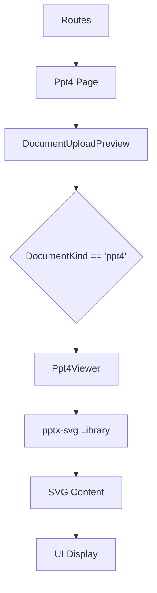

# DESIGN_ppt4

## 整体架构

`ppt4` 预览功能集成在现有的文件上传预览框架中。



## 核心组件设计: Ppt4Viewer

- **Props**:
  - `file: File`: 用户上传的 PPTX 文件。
- **内部逻辑**:
  - 使用 `FileReader` 将 `File` 转为 `ArrayBuffer`。
  - 调用 `pptx-svg` 的 API。由于 `pptx-svg` 可能是异步的且返回 SVG 列表，我们需要维护一个 `svgs: string[]` 的状态。
  - 遍历 `svgs` 并使用 `dangerouslySetInnerHTML` 渲染。
- **样式**:
  - 使用 LESS 模块或内联样式控制 SVG 容器，确保其在不同屏幕下居中并自适应。

## 接口契约

- `pptx-svg` 主要 API (预期):
  ```typescript
  import pptx from 'pptx-svg';
  const svgs = await pptx.convert(buffer);
  ```

## 异常处理

- 文件非 `.pptx` 格式校验。
- 渲染过程中的 `try-catch` 捕获，并反馈给父组件 `DocumentUploadPreview`。
