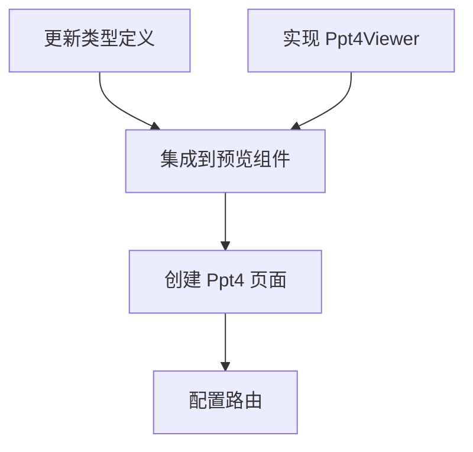

# TASK_ppt4

## 原子任务拆分

### 1. 更新类型定义

- **输入**: `src/services/uploadDocument.ts`
- **操作**: 增加 `ppt4` 到 `DocumentKind` 类型中。
- **输出**: 更新后的类型定义。
- **验收标准**: 类型推导正常。

### 2. 实现 Ppt4Viewer 组件

- **输入**: `src/pages/Upload/components/Ppt4Viewer.tsx`
- **操作**: 实现基于 `pptx-svg` 的渲染逻辑。
- **输出**: `Ppt4Viewer` 组件。
- **验收标准**: 能接收 `File` 并渲染出 SVG 内容。

### 3. 集成到 DocumentUploadPreview

- **输入**: `src/pages/Upload/components/DocumentUploadPreview.tsx`
- **操作**: 导入 `Ppt4Viewer` 并添加 `kind === 'ppt4'` 的分支逻辑。
- **输出**: 支持 `ppt4` 的预览容器。
- **验收标准**: `kind="ppt4"` 时能正确挂载 `Ppt4Viewer`。

### 4. 创建 Ppt4 页面

- **输入**: `src/pages/Upload/Ppt4/index.tsx`
- **操作**: 调用 `DocumentUploadPreview` 并传入 `kind="ppt4"`。
- **输出**: 新页面文件。
- **验收标准**: 页面结构符合项目规范。

### 5. 配置路由

- **输入**: `config/routes.ts`
- **操作**: 在文件上传路由组中添加 `PPT 预览 4`。
- **输出**: 更新后的路由配置。
- **验收标准**: 侧边栏出现新菜单，点击可进入新页面。

## 任务依赖图

