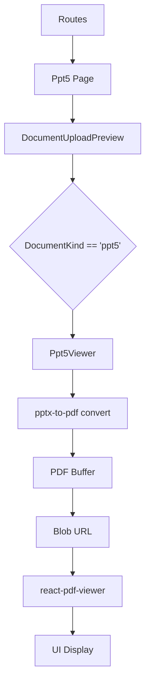

# DESIGN_ppt5

## 整体架构

`ppt5` 预览功能采用了“转换后预览”的策略。

## 核心组件设计: Ppt5Viewer

- **Props**:
  - `file: File`: 用户上传的 PPTX 文件。
- **内部逻辑**:
  - `useEffect` 监听 `file` 变化。
  - 使用 `file.arrayBuffer()` 获取数据。
  - 调用 `convert(buffer)` 进行转换。
  - `URL.createObjectURL(new Blob([pdfBuffer], { type: 'application/pdf' }))` 生成预览链接。
  - 使用 `@react-pdf-viewer/core` 渲染生成的 PDF。

## 异常处理

- 转换失败时（例如 PPTX 格式损坏或包含不支持的元素），显示错误提示。
- 处理资源释放：组件卸载时 `URL.revokeObjectURL`。

## UI 表现

- 转换期间显示 `Spin` 提示“正在转换为 PDF...”。
- 转换完成后显示 PDF 阅读器界面（含缩略图、搜索、下载等功能，取决于插件配置）。
