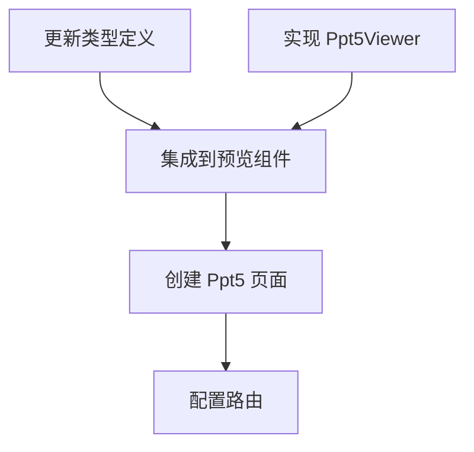

# TASK_ppt5

## 原子任务拆分

### 1. 更新类型定义

- **输入**: `src/services/uploadDocument.ts`
- **操作**: 增加 `ppt5` 到 `DocumentKind` 类型。

### 2. 实现 Ppt5Viewer 组件

- **输入**: `src/pages/Upload/components/Ppt5Viewer.tsx`
- **操作**: 实现 PPTX 转 PDF 并渲染的逻辑。
- **验收标准**: 能够正确调用 `pptx-to-pdf` 并展示 PDF。

### 3. 集成到 DocumentUploadPreview

- **输入**: `src/pages/Upload/components/DocumentUploadPreview.tsx`
- **操作**: 导入 `Ppt5Viewer` 并添加路由逻辑。

### 4. 创建 Ppt5 页面

- **输入**: `src/pages/Upload/Ppt5/index.tsx`
- **操作**: 调用预览组件。

### 5. 配置路由

- **输入**: `config/routes.ts`
- **操作**: 添加 `/upload/ppt5` 路径。

## 任务依赖图

