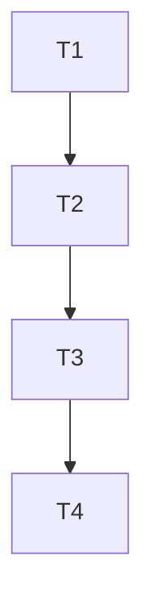

# TASK - upload-doc-enhancements

## 原子任务拆分

### T1 依赖引入

- 输入契约：package.json
- 输出契约：新增 docx-preview 与 @jvmr/pptx-to-html

### T2 组件能力增强

- 输入契约：DocumentUploadPreview
- 输出契约：支持 docx/pptx 渲染、大小限制、进度、重试

### T3 页面接入

- 输入契约：PDF/Word/PPT 页面
- 输出契约：传入 maxSizeMB 等参数

### T4 验收与文档

- 输入契约：实现完成
- 输出契约：ACCEPTANCE/FINAL/TODO 文档

## 任务依赖图

