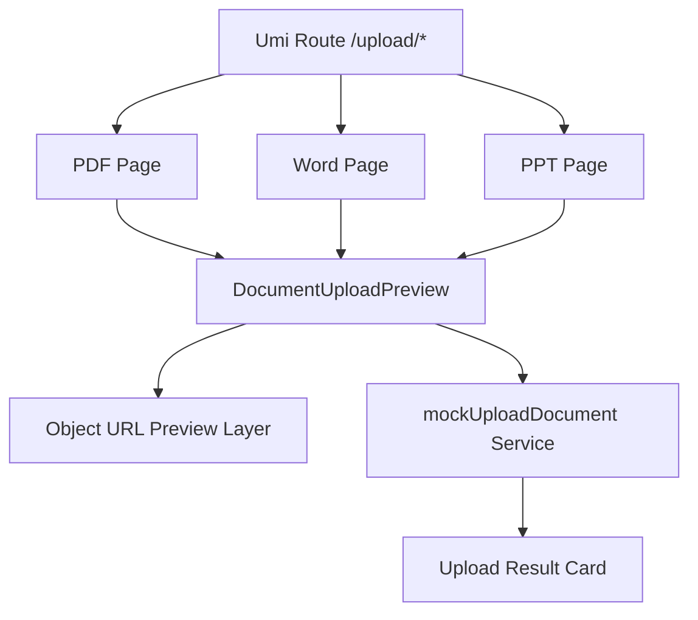
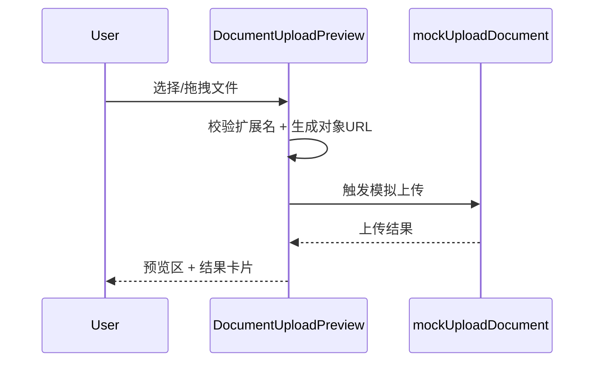

# DESIGN - upload-doc-preview

## 整体架构图

## 分层设计

- 路由层：`config/routes.ts`
- 页面层：`src/pages/Upload/Pdf|Word|Ppt/index.tsx`
- 组件层：`src/pages/Upload/components/DocumentUploadPreview.tsx`
- 服务层：`src/services/uploadDocument.ts`

## 模块依赖关系

## 接口契约

### DocumentUploadPreviewProps

- `title: string`
- `description: string`
- `accept: string`
- `allowedExtensions: string[]`
- `kind: 'pdf' | 'word' | 'ppt'`

### UploadDocumentResult

- `taskId: string`
- `fileName: string`
- `size: number`
- `uploadedAt: string`
- `kind: 'pdf' | 'word' | 'ppt'`

## 数据流

## 异常处理策略

- 扩展名不合法：拦截上传并提示
- 上传失败：展示 message.error，保留预览态
- 组件卸载/重复上传：释放旧对象 URL，避免内存泄漏
